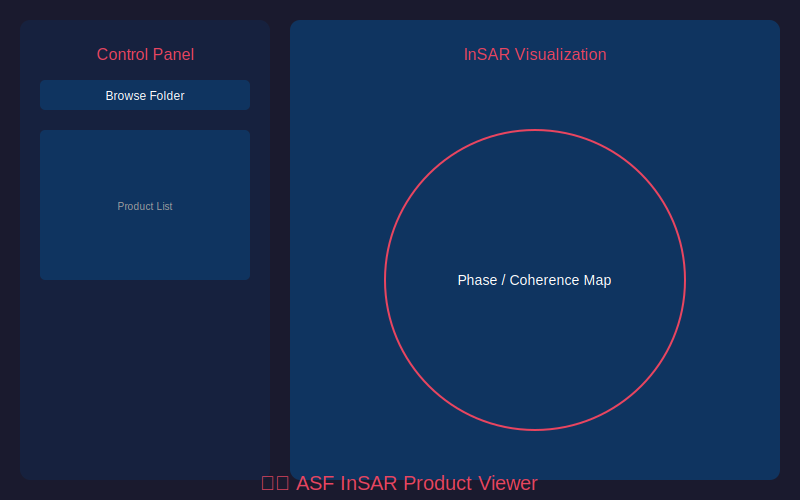

# InSAR Analysis Toolkit

[](https://www.python.org/)
[](LICENSE)
[]()

A comprehensive toolkit for visualizing and analyzing **Interferometric Synthetic Aperture Radar (InSAR)** data from ASF (Alaska Satellite Facility) On-Demand products.



---

## ✨ Features

### 🖥️ Desktop Applications
- **ASF InSAR Viewer** - Professional GeoTIFF viewer for InSAR products
- **Land Subsidence Analyzer** - Time-series analysis and displacement monitoring

### 🌐 Web Application
- **Streamlit Web App** - Browser-based viewer with interactive maps

### 📊 Supported Products
| Product Type | Description |
|--------------|-------------|
| Wrapped Phase | Interferometric phase (-π to π) |
| Unwrapped Phase | Continuous phase values |
| Coherence | Interferometric correlation (0-1) |
| Amplitude | Radar backscatter intensity |
| DEM | Digital Elevation Model |
| Displacement | Line-of-sight ground movement |

---

## 🚀 Quick Start

### Prerequisites
- Python 3.9 or higher
- pip package manager

### Installation

```bash
# Clone the repository
git clone https://github.com/yourusername/insar-toolkit.git
cd insar-toolkit

# Install dependencies
pip install -r requirements.txt
```

### Run Desktop Application

```bash
python src/ASF_InSAR_Viewer.py
```

### Run Web Application

```bash
streamlit run src/ASF_InSAR_Web_App.py
```

---

## 📁 Project Structure

```
insar-toolkit/
├── src/
│   ├── ASF_InSAR_Viewer.py          # Main desktop viewer
│   ├── ASF_InSAR_Viewer_Standalone.py
│   ├── ASF_InSAR_Web_App.py         # Streamlit web app
│   ├── Land_Subsidence_Analyzer.py  # Subsidence analysis tool
│   └── InSAR_Viewer.py              # Alternative viewer
├── scripts/
│   ├── build_exe.bat                # Windows executable builder
│   └── build_exe.py                 # Python build script
├── docs/
│   └── WINDOWS_EXE_GUIDE.md         # EXE creation guide
├── assets/
│   └── screenshot.png               # Application screenshots
├── requirements.txt
├── LICENSE
└── README.md
```

---

## 🔧 Dependencies

| Package | Purpose |
|---------|---------|
| `numpy` | Numerical operations |
| `matplotlib` | Visualization |
| `rasterio` | GeoTIFF reading |
| `streamlit` | Web application |
| `plotly` | Interactive plots |

Install all dependencies:
```bash
pip install numpy matplotlib rasterio streamlit plotly
```

---

## 📦 Building Standalone Executable (Windows)

Create a standalone `.exe` that runs without Python:

```bash
# Install PyInstaller
pip install pyinstaller

# Build executable
pyinstaller --onefile --windowed --name "ASF_InSAR_Viewer" src/ASF_InSAR_Viewer_Standalone.py
```

The executable will be in the `dist/` folder.

See [docs/WINDOWS_EXE_GUIDE.md](docs/WINDOWS_EXE_GUIDE.md) for detailed instructions.

---

## 🎯 Usage

### Loading Data
1. Launch the application
2. Click **"Browse Folder"**
3. Select a folder containing ASF InSAR GeoTIFF products
4. Products will be automatically detected and listed

### Viewing Products
- Click on any product in the list to display it
- Use the colormap dropdown to change visualization
- Zoom and pan using the matplotlib toolbar

### Comparing Products
- Click **"Compare"** to view multiple products side-by-side
- Select up to 4 products for comparison

---

## 📡 Getting InSAR Data

### Data Source
Download InSAR data from **ASF (Alaska Satellite Facility)**:

🔗 **https://search.asf.alaska.edu/**

### Step-by-Step Guide

1. **Create Account**
   - Go to [ASF Vertex](https://search.asf.alaska.edu/#/)
   - Click "Sign In" → Create an NASA Earthdata account (free)

2. **Search Data**
   - Draw a polygon over your area of interest
   - Set filters:
     - Dataset: `Sentinel-1`
     - File Type: `SLC` (for InSAR processing)
   - Select date range

3. **On-Demand Processing** (Recommended)
   - Select two SLC images (reference + secondary)
   - Click **"On Demand"** → **"InSAR GAMMA"**
   - Choose products: Unwrapped Phase, Coherence, Amplitude, etc.
   - Submit job (processing takes ~30 minutes)

4. **Download Products**
   - Go to "On Demand Queue" to check status
   - Download the GeoTIFF products when ready

5. **Load in Toolkit**
   - Open ASF InSAR Viewer
   - Browse to your downloaded folder
   - Visualize!

### Sample Data for Testing
ASF provides sample InSAR products:
- [ASF Sample Data](https://asf.alaska.edu/data-sets/derived-data-sets/insar/)

---

## 🤝 Contributing

Contributions are welcome! Please feel free to submit a Pull Request.

1. Fork the repository
2. Create your feature branch (`git checkout -b feature/AmazingFeature`)
3. Commit your changes (`git commit -m 'Add some AmazingFeature'`)
4. Push to the branch (`git push origin feature/AmazingFeature`)
5. Open a Pull Request

---

## 📄 License

This project is licensed under the MIT License - see the [LICENSE](LICENSE) file for details.

---

## 👤 Author

**Danesh Shokri**

- Research Focus: SAR/InSAR Remote Sensing
- Interests: Land subsidence monitoring, ground deformation analysis

---

## 🙏 Acknowledgments

- [ASF DAAC](https://asf.alaska.edu/) for InSAR processing services
- [ISCE2](https://github.com/isce-framework/isce2) framework
- [Rasterio](https://rasterio.readthedocs.io/) for GeoTIFF support

---

## 📞 Support

If you encounter any issues or have questions:
- Open an [Issue](https://github.com/yourusername/insar-toolkit/issues)
- Check existing issues for solutions
